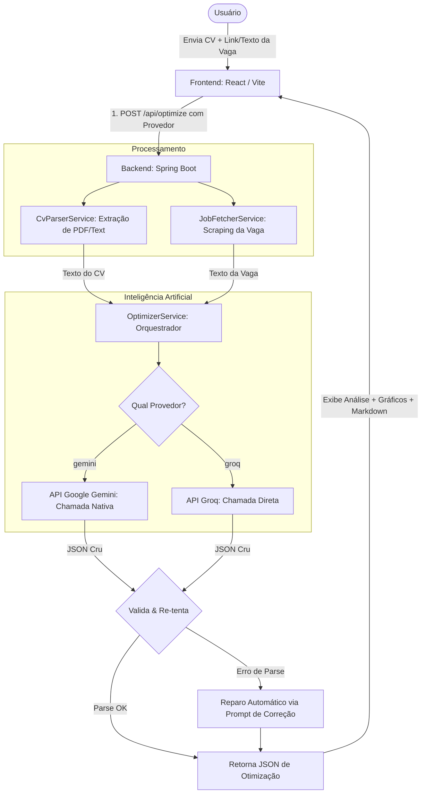

# CurriculoFit

Aplicação fullstack para otimizar currículos com IA, com foco em aderência a uma vaga específica e geração de análise objetiva de compatibilidade.

[](./LICENSE)

## Visão geral

O sistema recebe:
- currículo (`PDF`, `MD` ou `TXT`)
- vaga como URL ou texto livre

E retorna:
- currículo otimizado em Markdown
- diagnóstico de compatibilidade (score, pontos fortes, gaps, cobertura e recomendações)

## Arquitetura



## Stack

- **Backend:** Java 21, Spring Boot 3, Spring AI, WebClient, PDFBox
- **Frontend:** React 18, Vite, Recharts, React Markdown
- **Build/Testes:** Maven, JUnit 5, Mockito, MockMvc
- **Containers:** Docker, Docker Compose

## Pré-requisitos

- Java 21
- Maven 3.9+
- Node.js 20+
- Docker + Docker Compose (opcional)

## Configuração de ambiente

Use `.env.example` como base.

> [!IMPORTANT]
> **Atenção sobre os arquivos de ambiente local (`.env`):**
> O projeto utiliza **dois** arquivos `.env` sincronizados para rodar localmente. Certifique-se de copiar as suas configurações para ambos os locais:
> 1. Na **raiz do projeto** (`/.env`): Usado pelo Docker Compose e pelo build do Frontend.
> 2. Dentro de **`backend/`** (`/backend/.env`): Usado pelo Spring Boot (`spring-dotenv`) ao rodar via `mvn spring-boot:run`.

| Variável | Obrigatória | Descrição |
|---|---|---|
| `GEMINI_API_KEY` | Sim | Chave de API do Google Gemini (obtida no Google AI Studio) |
| `GROQ_API_KEY` | Sim | Chave de API do Groq |
| `GEMINI_MODEL` | Não | Nome do modelo do Gemini (Padrão: `gemini-2.5-flash`) |
| `GROQ_MODEL` | Não | Nome do modelo do Groq (Padrão: `llama-3.3-70b-versatile`) |
| `CORS_ALLOWED_ORIGINS` | Sim em produção | Origens permitidas no backend (separadas por vírgula) |
| `VITE_API_BASE_URL` | Sim em produção | URL pública do backend usada no build do frontend |
| `RATE_LIMIT_ENABLED` | Não | Ativa/desativa rate limit no `POST /api/optimize` |
| `RATE_LIMIT_REQUESTS_PER_MINUTE` | Não | Limite por IP por minuto |
| `JOB_FETCHER_TIMEOUT_SECONDS` | Não | Timeout para leitura de vaga por URL |
| `JOB_FETCHER_RETRY_MAX_ATTEMPTS` | Não | Tentativas de retry para busca externa |
| `JOB_FETCHER_RETRY_BACKOFF_MS` | Não | Backoff inicial (ms) entre tentativas |

## Execução local (sem Docker)

```powershell
# terminal 1
cd backend
mvn spring-boot:run
```

```powershell
# terminal 2
cd frontend
npm install
npm run dev
```

- Frontend: `http://localhost:5173`
- Backend: `http://localhost:8080`

## Execução com Docker

```powershell
$env:GEMINI_API_KEY="sua-chave-gemini"
$env:GROQ_API_KEY="sua-chave-groq"
$env:CORS_ALLOWED_ORIGINS="http://localhost:5173,http://localhost:5174,http://localhost"
docker compose up --build
```

- Frontend: `http://localhost`
- Backend: `http://localhost:8080`

Para rodar em segundo plano:

```powershell
docker compose up -d --build
```

Para encerrar:

```powershell
docker compose down
```

## Modo mock no frontend

Arquivo de controle: `frontend/src/testConfig.js`

- `USE_MOCK_DATA = true`: não chama backend/IA
- `USE_MOCK_DATA = false`: fluxo real via `POST /api/optimize`

## API

### `POST /api/optimize`

- **Content-Type:** `multipart/form-data`
- **Campos:**
  - `cvFile`: Arquivo do currículo (`PDF`, `MD` ou `TXT`)
  - `jobSource`: Texto ou URL da vaga (mínimo 20 caracteres)
  - `provider`: Provedor a ser utilizado (`gemini` ou `groq`, padrão: `gemini`)

### Exemplo de resposta de sucesso

```json
{
  "cv_otimizado": "# Nome\n...",
  "analise": {
    "score_compatibilidade": 78,
    "resumo": "Boa aderência geral...",
    "pontos_fortes": ["Java", "Spring Boot"],
    "gaps_criticos": ["AWS"]
  }
}
```

## Healthcheck

- `GET /actuator/health`
- `GET /actuator/health/readiness`

## Testes

```powershell
cd backend
mvn test
```

## Troubleshooting rápido

- **Erro:** "Falha ao chamar o provedor de IA..."
  - Valide se `GEMINI_API_KEY` e `GROQ_API_KEY` estão configurados corretamente no ambiente do backend (`.env` ou Render).
  - Confirme a disponibilidade do modelo e permissão da chave utilizada.
  - Para o Gemini, verifique se a cota da chave gratuita do AI Studio não foi excedida (erro 429).
- **Erro 405 no frontend publicado**
  - Revise `VITE_API_BASE_URL` no build do frontend.
  - Confirme que a requisição HTTP está indo para o backend, e não para o host do frontend.
- **Erro de CORS**
  - Ajuste `CORS_ALLOWED_ORIGINS` com o domínio real do frontend publicado (ex: `https://curriculofit.vercel.app/`).

## Estrutura do projeto

```text
curriculo-fit/
|-- backend/
|-- frontend/
|-- docker-compose.yml
|-- LICENSE
`-- README.md
```

## Licença

Este projeto está licenciado sob os termos da **MIT License**. Consulte o arquivo [LICENSE](./LICENSE).
